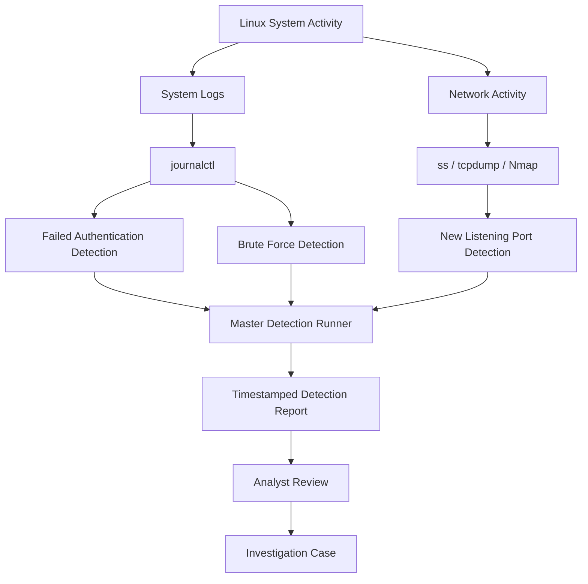
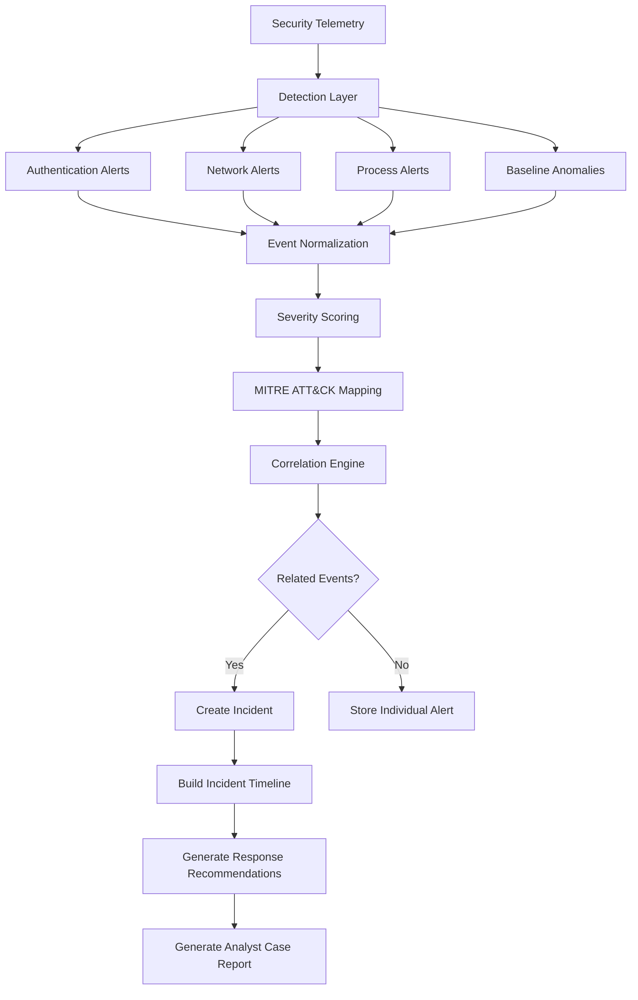

# BlueHarbor SOC Architecture

## Overview

BlueHarbor SOC is a lightweight security monitoring, detection engineering, incident response, and security automation platform built around a Linux-based analyst environment.

The project is designed to demonstrate how raw security telemetry can move through a practical SOC workflow:

**Data Collection -> Detection -> Alert Enrichment -> Correlation -> Investigation -> Incident Reporting**

BlueHarbor began as a Bash-based Linux SOC lab and is being expanded incrementally into a more complete detection and incident-response platform.

---

## Current Architecture

The current version operates inside a Debian Linux environment running on ChromeOS.



---

## Current Data Sources

### Linux System Logs

Linux system and authentication events are collected and reviewed using:

- journalctl
- authentication practice logs
- system service activity
- process and network information

These logs support authentication monitoring and security-event investigation.

### Network Telemetry

Network information is collected using:

- ss
- tcpdump
- Nmap
- DNS queries
- HTTP and HTTPS traffic analysis
- PCAP investigation

The project maintains a known-good baseline of listening sockets and compares current activity against that baseline.

---

## Detection Layer

BlueHarbor currently contains three primary detection methods.

### Log Matching

`failed-auth.sh`

Searches Linux system logs for authentication-related indicators such as:

- failed passwords
- authentication failures
- invalid users

### Threshold Detection

`brute-force.sh`

Groups failed login attempts by source IP address and raises an alert when activity reaches the configured threshold.

Current threshold:

`5 failed authentication attempts`

### Baseline Anomaly Detection

`new-listeners.sh`

Compares currently listening TCP and UDP sockets against a known-good baseline.

Unexpected listeners are flagged for analyst investigation.

---

## Detection Runner

The current Bash-based detection runner executes multiple detection scripts and combines their output into a timestamped report.

```text
Detection Scripts
       |
       v
run-detections.sh
       |
       v
Timestamped Detection Report
       |
       v
Analyst Review
```

This provides the foundation for the future BlueHarbor correlation engine.

---

## Investigation Layer

Security alerts can be investigated using:

- Linux system logs
- process information
- open ports and listening sockets
- network connections
- packet captures
- DNS information
- WHOIS information
- IOC enrichment
- SHA-256 file hashes

Investigation findings can then be documented in the `cases/` directory.

---

## BlueHarbor v2 Target Architecture

BlueHarbor v2 will introduce structured event processing and automated incident correlation.



---

## Planned Python Case Engine

The Python-based case engine will eventually perform the following workflow:

1. Parse detection output.
2. Normalize event fields.
3. Extract usernames, IP addresses, hosts, timestamps, and event types.
4. Assign severity.
5. Map events to MITRE ATT&CK.
6. Identify related activity.
7. Correlate multiple alerts into a single incident.
8. Build an incident timeline.
9. Recommend investigation and response actions.
10. Generate a structured analyst report.

Example future correlation:

```text
Repeated Failed Logins
        |
        v
Successful Login
        |
        v
Suspicious Process Activity
        |
        v
Network Anomaly
        |
        v
Possible Account Compromise
```

---

## Repository Components

```text
BlueHarbor-SOC/
|
|-- automation/
|   `-- case-engine/
|       `-- Python correlation and reporting
|
|-- cases/
|   `-- documented investigations
|
|-- detections/
|   |-- failed-auth.sh
|   |-- brute-force.sh
|   `-- new-listeners.sh
|
|-- docs/
|   `-- architecture/
|       `-- system design documentation
|
|-- logs/
|   `-- sanitized practice telemetry
|
|-- pcaps/
|   `-- packet captures excluded from public GitHub
|
|-- playbooks/
|   `-- incident-response procedures
|
|-- reports/
|   `-- generated security and investigation reports
|
|-- scripts/
|   |-- run-detections.sh
|   |-- ioc-check.sh
|   `-- file-triage.sh
|
`-- README.md
```

---

## Hardware Design Considerations

The current analyst workstation is a Chromebook with:

- ChromeOS
- Debian Linux environment
- Intel Pentium Silver N6000 processor
- 8 GB RAM

Because of these hardware constraints, BlueHarbor is being designed as a lightweight modular platform rather than attempting to run several resource-intensive virtual machines and security platforms simultaneously.

Future centralized monitoring components may be hosted separately while the Chromebook remains the analyst, development, automation, and investigation workstation.

---

## Security Controls

The public repository is configured to exclude sensitive material including:

- credentials
- authentication tokens
- private keys
- AWS configuration
- SSH configuration
- unsanitized logs
- raw PCAP files
- Python environment files

Repository history and tracked content are reviewed before public pushes to reduce the risk of exposing sensitive information.

---

## Design Goal

BlueHarbor is intended to demonstrate the complete reasoning chain behind practical security operations:

Observe activity -> Detect abnormal behavior -> Validate the alert -> Gather evidence -> Correlate events -> Assess severity -> Respond -> Document the incident

The architecture will continue evolving as new detections, automation, monitoring, and incident-response capabilities are added.
